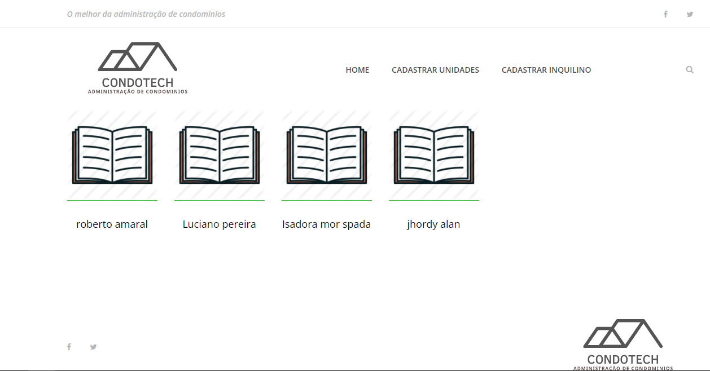
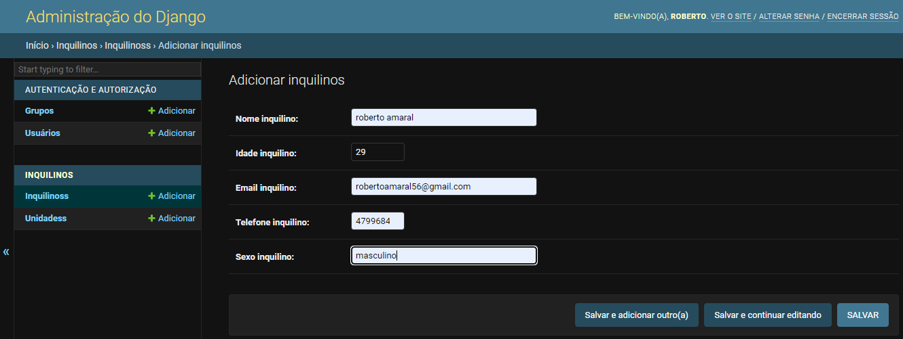
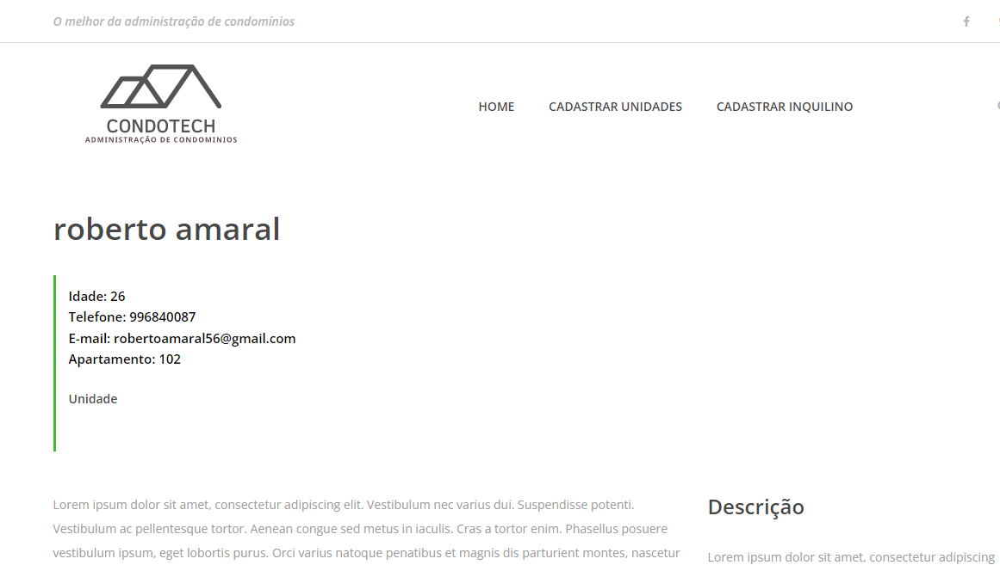

# Condotech (Veja abaixo das imagens como rodar a aplicação)





Django software para administração de condomínios
### Next steps

- [x] Django 
- [x] Postgresql
- [x] Adicionar visualizar e editar: inquilinos, unidades, despesas unidades


## 💻 Requerimentos

Antes de começar certifique-se de ter os seguintes requerimentos: 

* Most recent version of `Django`
* Python `pip` installed 
* Use  `Windows / Linux / Mac`.

## 🚀 Instalando a aplicação

Para instalar siga esses passos: 

Clone o repositório:
```
git clone https://github.com/betows/Distance_Meter.git
```

Entre na página root do projeto
```
cd desafioAPcoders/
```
Inicie o virtualenv 
```
python -m virtualenv .venv
```
Instale as dependencias
```
pip install -r requirements.txt
```

## ☕ Usando condotech

para usar a aplicação faça o seguinte:

Com o ambiente virtual ativado use o comando:
```
python manage.py run
```


## 📫 contribuindo com condotech

Para contribuir com este projeto siga os passos:

1. De um fork no repositório.
2. Crie uma branch: `git checkout -b <branch_name>`.
3. Faça as mudanças e de o commit: `git commit -m '<commit_message>'`
4. Mande para a branc original: `git push origin Distance_Meter / <local>`
5. Crie um request.

